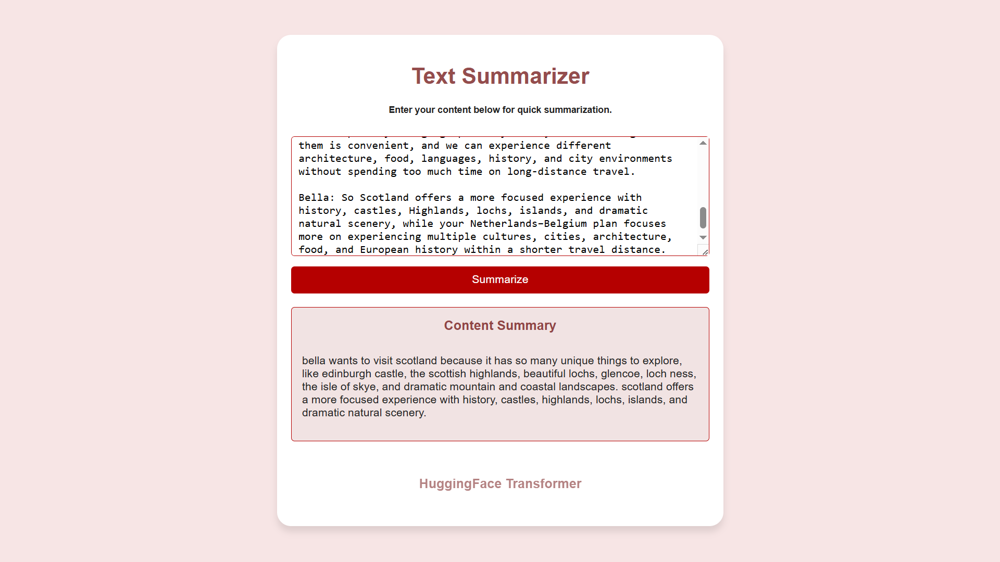

# Text Summarizer using Hugging Face Transformers

An awesome dialogue summarization system using Hugging Face T5 with fine-tuning.

## Demo



## Tech Stack

- Python
- FastAPI
- Uvicorn
- PyTorch
- Hugging Face T5
- Pydantic
- Jinja2
- HTML / CSS / JavaScript

## Prerequisites

- Python 3.9+
- `saved_summary_model` folder is available before running the application — the app will fail to load without it.

## Installation

1. **Clone the repository**

   ```bash
   git clone <>
   cd text-summarizer
   ```

2. **Create a virtual environment**

   ```bash
   python -m venv .venv
   ```

3. **Activate the virtual environment**

   Windows (PowerShell):

   ```powershell
   .\.venv\Scripts\Activate.ps1
   ```

   macOS / Linux:

   ```bash
   source .venv/bin/activate
   ```

4. **Install dependencies**

   ```bash
   pip install fastapi uvicorn transformers torch jinja2
   ```

## Running the Application

Start the FastAPI server:

```bash
uvicorn app:app --reload
```

## Notes

- Make sure the `saved_summary_model` folder is available before running the application — the app will fail to load without it.
- Always activate the virtual environment before installing dependencies or running the server.
- The `.venv` directory and large model files are excluded from Git via `.gitignore`.
- Jupyter notebooks used for training/fine-tuning the summarization model are included for reference and reproducibility.

## License

This project is licensed under the [MIT License](LICENSE).
